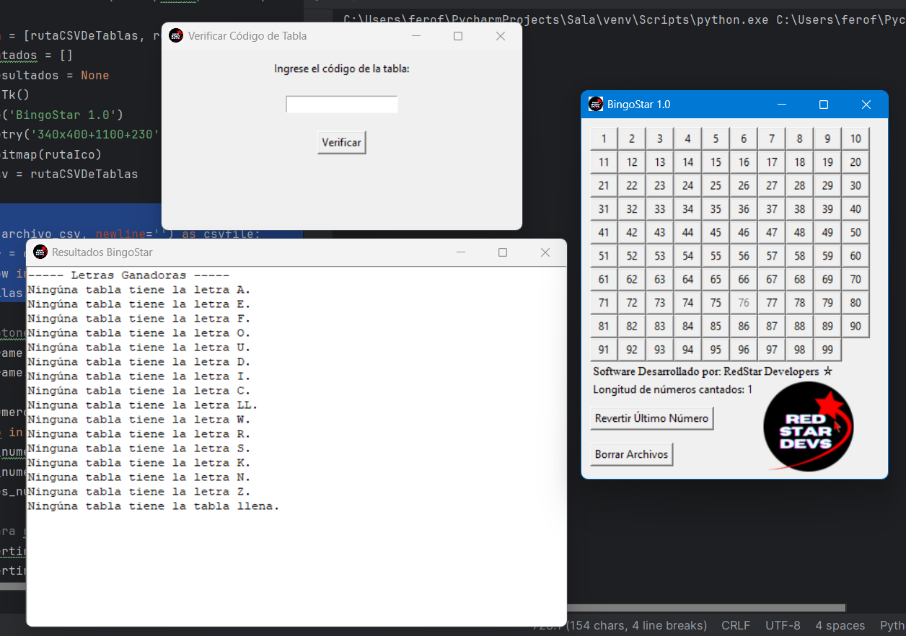
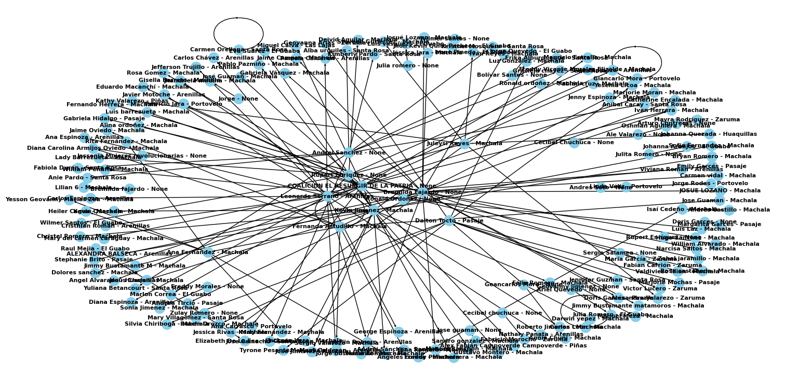

# Félix Romero Fernández

**Estudiante de Ingeniería en Computación**  
Apasionado por el desarrollo de software, la resolución de problemas mediante la tecnología y el uso de las matemáticas aplicadas.

Me considero una persona proactiva, adaptable y comprometida. Me destaco por mi capacidad de comunicación efectiva, aprendizaje continuo y disposición para trabajar arduamente en cualquier proyecto que emprendo.

---

## Proyectos Destacados

### BingoStar
**Descripción:** Aplicación desarrollada en Python para la generación automática de cartones de bingo y la posterior ejecución del juego.  
**Tecnologías:** Python  
**Estado:** Completado  
- [Repositorio de generación de tablas](https://github.com/Ferofern/generadorTablasBingo)  
- [Repositorio del juego completo](https://github.com/Ferofern/BingoFacil)

---

### ContaVotos
**Descripción:** Sistema para registrar actas y contar votos, orientado al control electoral en Ecuador.  
**Tecnologías:** Python  
**Estado:** Completado  
- [Ver repositorio](https://github.com/Ferofern/ContaVotos)

---

### Análisis de Redes Políticas
**Descripción:** Aplicación que permite visualizar, mediante grafos, las conexiones políticas y sociales entre miembros de un partido político. Su objetivo es identificar posibles líderes y optimizar la gestión del talento humano.  
**Tecnologías:** Python (con librerías para análisis de grafos)  
**Estado:** Completado  
- [Ver repositorio](https://github.com/Ferofern/AnalisGrafoPolitica)

---

## Tecnologías

- Python  
- Java  
- R  
- C  
- MySQL  
- Git y GitHub  
- Desarrollo de interfaces básicas  
- Automatización de procesos  
- Análisis de grafos  
- Lógica matemática aplicada

---

## Contacto

- Correo institucional: [ferofern@espol.edu.ec](mailto:ferofern@espol.edu.ec)  
- GitHub: [github.com/Ferofern](https://github.com/Ferofern/ferofern)

---

